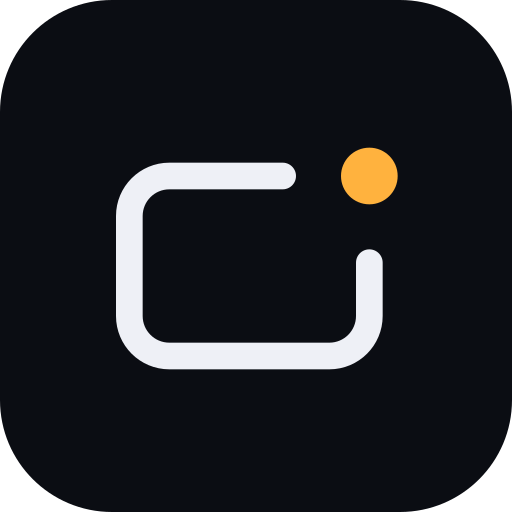

<div align="center">



# Air-Deck

**Control your slides with hand gestures. No mouse, no clicker, just air.**

Drop a PDF, raise your hand, and present — 100% in the browser, nothing ever leaves your machine.

<p>
  
  
  
  
  
</p>
<p>
  
  
  
  
  
</p>

</div>

---

## Table of contents

- [Overview](#overview)
- [Design principles](#design-principles)
- [Features](#features)
- [Gesture vocabulary](#gesture-vocabulary)
- [Keyboard fallback](#keyboard-fallback)
- [Tech stack](#tech-stack)
- [Project structure](#project-structure)
- [Getting started](#getting-started)
- [Privacy & security](#privacy--security)
- [Roadmap](#roadmap)
- [Known limitations](#known-limitations)
- [License](#license)
- [Author](#author)

## Overview

**Air-Deck** turns any PDF into a hands-free, gesture-controlled presentation. Drop a file in, and it becomes a full-screen deck you drive with your hand in front of the webcam — no mouse, no clicker, no assistant hovering by the laptop to hit "next slide."

It's built for **teachers and speakers**, runs entirely **client-side** (no backend, no upload — your file never leaves the browser), and is meant to feel like a real presentation tool, not a demo page.

## Design principles

The gesture system was designed around four non-negotiable priorities, in this order:

| # | Principle | What it means in practice |
|---|---|---|
| 1 | **Fluidity / low latency** | Hand tracking runs off the main thread in a Web Worker; cursor motion is smoothed with a One Euro Filter tuned for near-zero perceived lag |
| 2 | **Elegance** | A restrained "paper & marker" visual language — no clutter competing with your slides |
| 3 | **No gesture overlap** | One gesture can never accidentally trigger another action — every pose has its own confirmation window and hysteresis |
| 4 | **Accessibility** | Nothing requires pixel-perfect stillness — the system assumes hands shake and designs tolerance in from the start |

## Features

- 🖐️ **Real-time hand tracking** with MediaPipe's Hand Landmarker, running in a dedicated Web Worker with a main-thread fallback
- 📄 **Client-side PDF rendering** via `pdf.js` — pages are decoded straight to `ImageBitmap`, no server round-trip
- ✍️ **Freehand ink annotation** with live shape recognition — pen strokes, rectangles, circles/ellipses, and arrows, each triggered by its own pinch
- 🔧 **Move & resize** any shape right after drawing it, via on-canvas handles
- 🎯 **Laser pointer & magnifier zoom** that follows the fingertip, with smooth spring-based zoom transitions
- 🎨 **Adaptive ink color** — automatically switches between amber and red based on each slide's brightness for contrast
- 🎓 **Built-in gesture trainer** — a guided, three-step hand calibration flow plus hands-on practice challenges before your first real presentation
- ⌨️ **Full keyboard fallback** for every gesture-driven action
- 💾 **Local persistence only** — recent PDFs cached in IndexedDB, preferences in `localStorage`, with a one-click "Delete my data"
- 🧪 **Automated test suite** covering gesture classification and shape recognition logic

## Gesture vocabulary

| Gesture | Action |
|---|---|
| ☝️ Point with index finger | Active pointer tool from the menu — **Laser** (default), **Zoom**, or **Eraser** |
| 🤏 Thumb + Index pinch | **Pen** — stabilized freehand ink; a steady stroke snaps into a clean line |
| 🤏 Thumb + Middle pinch | **Rectangle** — drag corner to corner |
| 🤏 Thumb + Ring pinch | **Circle / ellipse** — drag corner to corner, or trace the outline |
| 🤏 Thumb + Pinky pinch | **Arrow** — from where the pinch starts to where it's released |
| 👎 Thumb down, held | **Clear** the current slide's ink |
| 👍 Thumb up, held | **Confirm** — closes whatever panel is open (menu, help, settings) |
| ✌️ Two fingers pointing sideways, held | **Navigate** — right advances, left goes back, one slide at a time |
| 🖐️ Open palm, held | **Open the tool menu** |
| ✊ Raise / lower a closed fist | **Zoom** on the last laser point |
| 🙌 Both hands open | **Reset zoom** to 1× |
| 3 fingers up, held | **Undo** last ink action |
| 4 fingers up (thumb tucked), held | **Redo** |

> The full state machine — confirmation windows, jitter tolerance, and pinch-classification thresholds — lives in [`src/lib/gestures.ts`](src/lib/gestures.ts).

## Keyboard fallback

Every gesture has a keyboard equivalent, so the app is fully usable without a camera:

`←/→`, `Space`, `PgUp/PgDn` navigate · `M` menu · `1–5` menu options · `B` blackout · `E` clear ink · `Z` undo · `Y` / `Shift+Z` redo · `+/− `, `0` zoom · `L` laser/pen (mouse) · `C` camera · `T` trainer · `F` fullscreen · `?` help · `Esc` exit

## Tech stack

| Layer | Choice |
|---|---|
| Build tool | [Vite](https://vitejs.dev/) 8 |
| UI | [React](https://react.dev/) 19 + [TypeScript](https://www.typescriptlang.org/) 6 |
| Animation | [Motion](https://motion.dev/) (Framer Motion) |
| Hand tracking | [`@mediapipe/tasks-vision`](https://developers.google.com/mediapipe) — Hand Landmarker, in a Web Worker |
| PDF rendering | [`pdf.js`](https://mozilla.github.io/pdf.js/) |
| Pointer smoothing | Custom One Euro Filter implementation |
| Linting | [oxlint](https://oxc.rs/docs/guide/usage/linter.html) |
| Testing | [Vitest](https://vitest.dev/) |
| Deploy target | [Vercel](https://vercel.com/) |

## Project structure

```
air-deck/
├── brand/                  # Visual identity — design tokens, marks, brand kit
├── docs/                   # Internal engineering notes
├── public/models/          # MediaPipe hand landmarker model, served locally
└── src/
    ├── App.tsx              # Switches between Home and Presenter
    ├── components/
    │   ├── Home.tsx          # Landing screen — drop a PDF, gesture list, start trainer
    │   ├── Presenter.tsx     # The presentation itself — slides, zoom, ink, HUD, menu
    │   ├── Trainer.tsx       # Guided hand calibration + practice challenges
    │   └── ToolMenu.tsx      # Point-and-hold radial-style tool menu
    ├── lib/
    │   ├── gestures.ts       # Gesture engine — pose classification & state machine
    │   ├── controller.ts     # Wires gesture output to cursor, ink and host actions
    │   ├── shapes.ts         # Shape recognition, handles, resize/move
    │   ├── ink.ts            # Per-slide ink layer, in slide-space units
    │   ├── overlay.ts        # Screen-space overlay — cursors, chevrons, zoom marker
    │   ├── tracker.ts        # Shared camera + worker lifecycle, latency stats
    │   └── oneEuro.ts        # One Euro Filter + point smoothing
    └── workers/
        └── hands.worker.ts   # MediaPipe inference off the main thread
```

## Getting started

**Prerequisites:** Node.js `>= 20.19`

```bash
# Clone the repository
git clone https://github.com/sidnei-almeida/air-deck.git
cd air-deck

# Install dependencies
npm install

# Start the dev server
npm run dev      # http://localhost:5173

# Run the test suite
npm test

# Build for production
npm run build
```

## Privacy & security

Air-Deck was built to be trustworthy by default:

- **No backend, no upload** — your PDF and camera feed are processed entirely on-device
- **Camera permission is scoped** — response headers explicitly lock down `Permissions-Policy` to camera only, denying microphone and geolocation
- **You control your data** — recent files and preferences are stored locally, with a one-click option to delete everything

## Roadmap

Ideas on the table for future iterations:

- 🖥️ Presenter mode on a second screen
- 🗂️ Slide overview / grid view
- 📱 Remote control from a phone via QR code
- 🎥 Session recording
- 🎙️ Voice commands
- 🗳️ Live audience voting
- 🔥 Laser attention heatmap across a session

## Known limitations

This is an actively evolving, experimental project:

- Tracking is temporarily lost if your hand leaves the camera frame
- Freehand rectangle recognition is still less reliable than the other shapes
- Best used in good, even lighting for consistent hand tracking

## License

No license has been published for this repository yet. Until one is added, please reach out to the author before reusing or redistributing the code.

## Author

Built by **[Sidnei Almeida](https://github.com/sidnei-almeida)** — AI Engineer & Full Stack Developer.

<div align="center">

Made with 🖐️, ☕ and a webcam.

</div>
